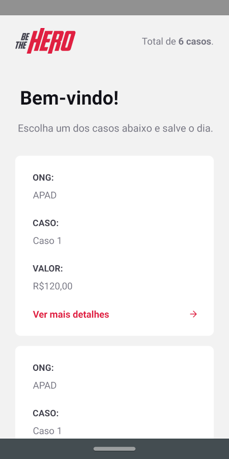

<!-- então bora codar! -->

<h1 align="center">
    
</h1>

<h2 align="center"> Aplicação que compartilha casos de ONGs com usuários interessados em ajudar. Feito com React, React Native, Nodejs, Express e SQLite. </h2>

<p align="center">  </p>

## Para rodar a aplicação

> OBS: pode-se utilizar o gerenciador de pacotes npm ou o yarn para rodar os comandos abaixo

Execute ```npm install``` nas pastas backend, frontend e mobile, para instalar as dependências.

Rode ```npm start``` nas pastas backend e frontend para utilizar a versão web. Acesse via **localhost:3000**.

Rode ```npm start``` nas pastas backend e mobile, acesse **localhost:19002**, leia o QR Code no seu celular e utilize o aplicativo  Expo para rodar a versão mobile no seu smartphone. Ou com algum emulador Android/iOS para rodar no seu computador.

## Telas

<p align="center">
    
    
    
    
    
    
    
    
    
    
</p>
